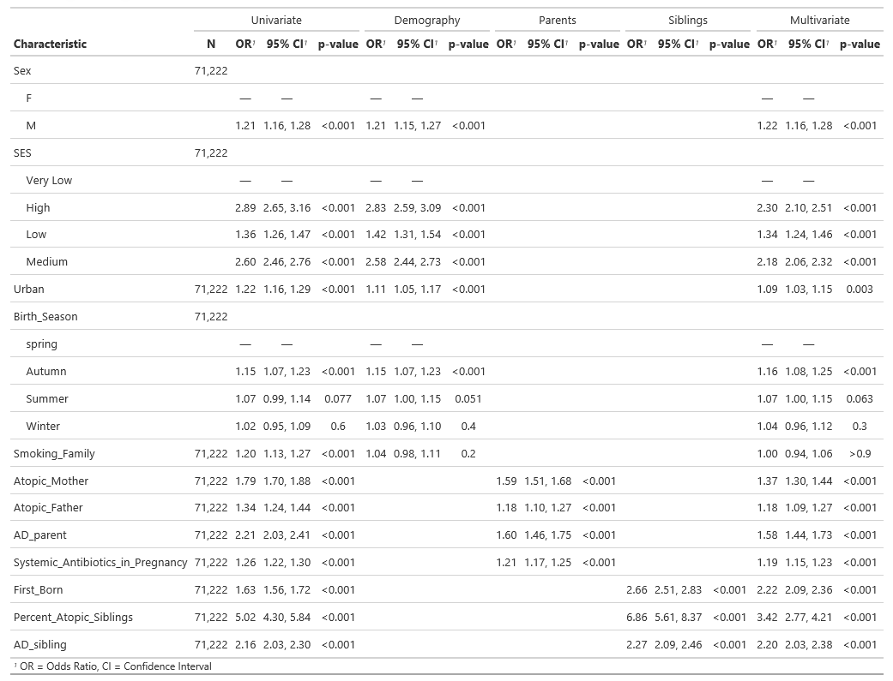

# Development and Validation of a Prognostic Clinical Risk Score for Subsequent Atopic Dermatitis Risk  <br>
 Supplementary materials for the development and validation of atopic dematitis score in utero <br>
 * Full pragnosis model can be found in score_algorithm.py <br>
 * Questionnaire.py file is the questionnaire form of the model. Run this code to answer the questions and get an AD risk result per patient. 

## Table 1 **<br>**

The development and validation patiants characteristics 

```
| Category                       | Sub-category                          | IFPS2 Control (n=1,418) | IFPS2 AD up to 1Y (n=389) | P-Value | LEUMIT Control (n=63,852) | LEUMIT AD up to 3Y (n=7,370) | P-Value |
|--------------------------------|---------------------------------------|-------------------------|---------------------------|---------|---------------------------|------------------------------|---------|
| Sex                            | Male (%)                              | 663 (46.8)              | 221 (41.1)                | <.001   | 33,072 (51.8)             | 4173 (56.6)                 | <.001   |
| Urbanity                       | Urban (%)                             | 411 (29)                | 138 (35.5)                | <.05    | 37,431 (58.6)             | 4674 (63.4)                 | <.001   |
| Birth Season                   | Autumn                                | 501 (35.3)              | 160 (41.1)                | <.05    | 16,709 (28.3)             | 2085 (28.3)                 | <.001   |
|                                | Summer                                | 314 (22.1)              | 92 (23.7)                 | -       | 16,095 (25.2)             | 1868 (25.3)                 | -       |
|                                | Winter                                | 585 (41.3)              | 130 (33.4)                | -       | 16,016 (25.1)             | 1779 (24.1)                 | -       |
|                                | Spring                                | 18 (1.3)                | 7 (1.8)                   | -       | 15,032 (23.5)             | 1638 (22.2)                 | -       |
| Family History                 | Smoke record (%)                      | 298 (21)                | 54 (13.9)                 | <.01    | 11,787 (18.5)             | 1575 (21.4)                 | <.001   |
|                                | Parent with an atopic condition (%)   | 308 (21.7)              | 132 (33.9)                | <.001   | 22,594 (35.2)             | 3620 (49.1)                 | <.001   |
|                                | Parents with atopic dermatitis (%)    | 100 (7.1)               | 81 (20.8)                 | <.001   | 2934 (4.6)                | 710 (9.6)                   | <.001   |
|                                | Both Parents Atopic (%)               | 36 (2.5)                | 21 (5.4)                  | <.01    | 2410 (3.8)                | 455 (6.2)                   | <.001   |
| Sibling History                | First Born (%)                        | 388 (27.4)              | 121 (31.1)                | 0.16    | 23,069 (36.1)             | 3541 (48)                   | <.001   |
|                                | Sibling with an atopic condition (%)  | 162 (11.4)              | 81 (20.8)                 | <.001   | 19,500 (30.5)             | 2553 (34.6)                 | <.001   |
|                                | Siblings with atopic dermatitis (%)   | 111 (7.8)               | 92 (23.7)                 | <.001   | 6854 (10.7)               | 1520 (20.6)                 | <.001   |
| Systemic Antibiotics taken     | 0                                     | -                       | -                         | -       | 49,298 (77.2)             | 5010 (68)                   | <.001   |
| during pregnancy               | 1                                     | -                       | -                         | -       | 9508 (14.9)               | 1543 (20.9)                 | -       |
|                                | 2                                     | -                       | -                         | -       | 3211 (5)                  | 520 (7.1)                   | -       |
|                                | 3                                     | -                       | -                         | -       | 1835 (2.9)                | 297 (4.1)                   | -       |

```


## Table 2 **<br>**

The adjusted and unadjusted association between the score's varaiables and outcome (AD).



```
| Characteristic | N | Univariate OR¹ | 95% CI² | p-value | Demography OR' | 95% CI' | p-value | Parents OR' | 95% CI' | p-value | Siblings OR' | 95% CI' | p-value | Multivariate OR' | 95% CI' | p-value |
|----------------|---|----------------|---------|---------|----------------|---------|---------|-------------|---------|---------|--------------|---------|---------|------------------|---------|---------|
| Sex            |   |                |         |         |                |         |         |             |         |         |              |         |         |                  |         |         |
| - F            |   |                |         |         |                |         |         |             |         |         |              |         |         |                  |         |         |
| - M            |   |                |         |         |                |         |         |             |         |         |              |         |         |                  |         |         |
| SES_group      |   |                |         |         |                |         |         |             |         |         |              |         |         |                  |         |         |
| ...            |   |                |         |         |                |         |         |             |         |         |              |         |         |                  |         |         |

¹ OR = Odds Ratio
² CI = Confidence Interval

```

```
| Characteristic              | N     | Univariate OR | 95% CI      | p-value | Demography OR | 95% CI      | p-value | Parents OR | 95% CI      | p-value | Siblings OR | 95% CI      | p-value | Multivariate OR | 95% CI      | p-value |
|-----------------------------|-------|---------------|-------------|---------|---------------|-------------|---------|------------|-------------|---------|-------------|-------------|---------|-----------------|-------------|---------|
| Sex                         |       |               |             |         |               |             |         |            |             |         |             |             |         |                 |             |         |
| - F                         | 71,222|               |             |         |               |             |         |            |             |         |             |             |         |                 |             |         |
| - M                         |       | 1.21          | 1.16, 1.28  | <0.001  | 1.22          | 1.16, 1.28  | <0.001  |            |             |         |             |             |         |                 |             |         |
| SES_group                   |       |               |             |         |               |             |         |            |             |         |             |             |         |                 |             |         |
| Very Low                           | 71,222|               |             |         |               |             |         |            |             |         |             |             |         |                 |             |         |
| Low-Medium                           |       | 1.36          | 1.26, 1.47  | <0.001  | 1.34          | 1.24, 1.46  | <0.001  |            |             |         |             |             |         |                 |             |         |
| Medium-High                           |       | 2.60          | 2.46, 2.76  | <0.001  | 2.18          | 2.06, 2.32  | <0.001  |            |             |         |             |             |         |                 |             |         |
| High                           |       | 2.89          | 2.65, 3.16  | <0.001  | 2.30          | 2.10, 2.51  | <0.001  |            |             |         |             |             |         |                 |             |         |
| Urban                       | 71,222| 1.22          | 1.16, 1.29  | <0.001  | 1.09          | 1.03, 1.15  | 0.003   |            |             |         |             |             |         |                 |             |         |
| Birth Season                |       |               |             |         |               |             |         |            |             |         |             |             |         |                 |             |         |
| - spring                    | 71,222|               |             |         |               |             |         |            |             |         |             |             |         |                 |             |         |
| - Autumn                    |       | 1.15          | 1.07, 1.23  | <0.001  | 1.16          | 1.08, 1.25  | <0.001  |            |             |         |             |             |         |                 |             |         |
| - Summer                    |       | 1.07          | 0.99, 1.14  | 0.077   | 1.07          | 1.00, 1.15  | 0.063   |            |             |         |             |             |         |                 |             |         |
| - Winter                    |       | 1.02          | 0.95, 1.09  | 0.6     | 1.04          | 0.96, 1.12  | 0.3     |            |             |         |             |             |         |                 |             |         |
| Smoking                | 71,222| 1.20          | 1.13, 1.27  | <0.001  | 1.00          | 0.94, 1.06  | >0.9    |            |             |         |             |             |         |                 |             |         |
| Atopic Mother               |       | 1.79          | 1.70, 1.88  | <0.001  | 1.37          | 1.30, 1.44  | <0.001  |            |             |         |             |             |         |                 |             |         |
| Atopic Father               |       | 1.34          | 1.24, 1.44  | <0.001  | 1.18          | 1.09, 1.27  | <0.001  |            |             |         |             |             |         |                 |             |         |
| Parent w AD                   |       | 2.21          | 2.03, 2.41  | <0.001  | 1.58          | 1.44, 1.73  | <0.001  |            |             |         |             |             |         |                 |             |         |
| First Born                  |       | 1.63          | 1.56, 1.72  | <0.001  | 2.66          | 2.51, 2.83  | <0.001  |            |             |         |             |             |         | 2.22            | 2.09, 2.36  | <0.001  |
| Percent of Atopic Siblings     |       | 5.02          | 4.30, 5.84  | <0.001  | 3.42          | 2.77, 4.21  | <0.001  |            |             |         |             |             |         |                 |             |         |
| AD_sibling                  |       | 2.16          | 2.03, 2.30  | <0.001  | 2.20          | 2.03, 2.38  | <0.001  |            |             |         |             |             |         |                 |             |         |
| Systemic Antibiotics During Pregnancy  |       | 1.26          | 1.22, 1.30  | <0.001  |               |             |         |            |             |         |             |             |         | 1.19            | 1.15, 1.23  | <0.001  |

¹ OR = Odds Ratio
² CI = Confidence Interval
```
